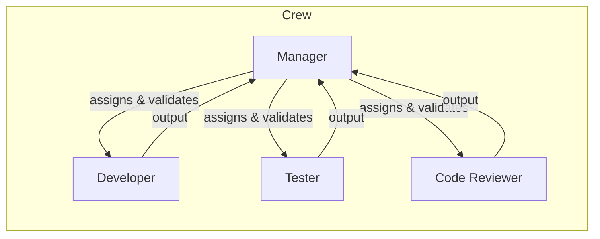

# CrewAI agents for continuous software improvement and testing

You'd use a **hierarchical crew** with a **manager agent** plus several **specialist agents**: Developer, Tester, and Code Reviewer. Optionally add a Researcher. Run the crew in the background via **async kickoff** and a scheduler or daemon.

---

## 1. Agent types to use

| Agent                     | Role               | Goal                                                                                                  | Why                                                                                               |
| ------------------------- | ------------------ | ----------------------------------------------------------------------------------------------------- | ------------------------------------------------------------------------------------------------- |
| **Manager**               | Orchestrator       | Decide what to improve next, assign tasks to the right agent, and validate outputs before continuing. | Required for hierarchical process; drives "what to do next" and quality gates.                    |
| **Developer**             | Software developer | Implement improvements, fix bugs, and add features from task descriptions and review feedback.        | Does the actual code changes; needs code execution and file/shell tools.                          |
| **Tester**                | QA / test engineer | Run the test suite, interpret results, and report failures and flakiness.                             | Ensures every change is tested; needs tools to run tests (e.g. pytest, npm test) and read output. |
| **Code Reviewer**         | Senior reviewer    | Review diffs for correctness, style, and security; suggest improvements.                              | Catches issues before they're "done"; uses read-only codebase tools and optionally linters.       |
| **Researcher** (optional) | Tech researcher    | Find docs, patterns, or prior art for improvements or new features.                                   | Useful if you want the system to look up best practices or external knowledge.                    |

Manager is created by CrewAI when you use **hierarchical process** (you supply `manager_llm`; optionally a custom `manager_agent`). The others you define as normal CrewAI agents with role, goal, backstory, and tools.

---

## 2. Crew structure and process

Use **hierarchical process** so the manager can:

- Choose the next improvement (e.g. "add tests for module X", "refactor Y", "fix failing test Z").
- Assign tasks to Developer, Tester, or Code Reviewer.
- Decide whether to re-assign (e.g. "Tester: run tests" → "Developer: fix failing test" → "Tester: re-run") or continue.

- **Sequential process** is an alternative only if you want a fixed pipeline (e.g. Review → Improve → Test → Fix) with no dynamic "what to do next" decisions.
- **Conditional tasks** (e.g. "if tests fail, run fix task") can be combined with either process.

---

## 3. Tools per agent

- **Developer**: File read/write, run shell commands (or CrewAI code execution with `allow_code_execution=True`, e.g. in Docker "safe" mode), and optionally git (branch, commit). Give access only to repo paths you want auto-changes in.
- **Tester**: Run tests (e.g. `pytest`, `npm test`, `cargo test`) and read stdout/stderr and result files (e.g. JUnit XML, coverage). No need for code execution if tests run via shell tools.
- **Code Reviewer**: Read files and diffs, optionally run linters/formatters (read-only or suggest-only) so the Developer agent can apply fixes.
- **Manager**: Usually no extra tools; uses delegation and task outputs. Optionally a "state" or "backlog" tool if you persist improvement ideas.
- **Researcher** (if used): Web/search tools (e.g. SerperDevTool) or internal doc search.

---

## 4. Running continuously in the background

- Use **async kickoff** so the crew doesn't block: e.g. `crew.kickoff_async(inputs=...)` and then poll or await the result. That lets your "runner" process start a crew and do other work or start the next cycle later.
- Run the crew on a schedule or trigger:
  - **Scheduler**: cron, APScheduler, or Celery beat that periodically calls your script to `kickoff_async` (e.g. "every night" or "every 6 hours").
  - **Daemon**: a long-running process that in a loop waits (or listens for events), then kicks off the crew and optionally waits for completion before the next run.
  - **CI/CD**: e.g. GitHub Actions workflow that triggers on push/schedule and runs the crew (sync or async depending on how you invoke it).
- For "continuous improvement" semantics, give the crew **inputs** each run: e.g. `target_repo`, `focus_area` (e.g. "auth module"), `improvement_goals` (e.g. "increase coverage, then refactor"). The manager uses these to generate tasks for the specialists.

---

## 5. Testing the crew itself

Use CrewAI's own testing to evaluate crew behavior and quality:

- **crewai test** (CLI): run the crew multiple times (`--n_iterations`) and inspect task/crew scores and execution time. Helps catch regressions in prompts and task design.
- Start with a **small, deterministic scenario** (e.g. "add a unit test for X") so outputs are comparable across runs.
